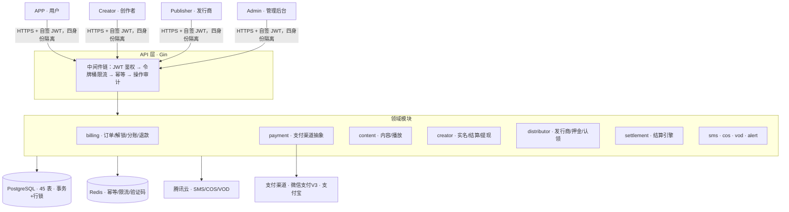
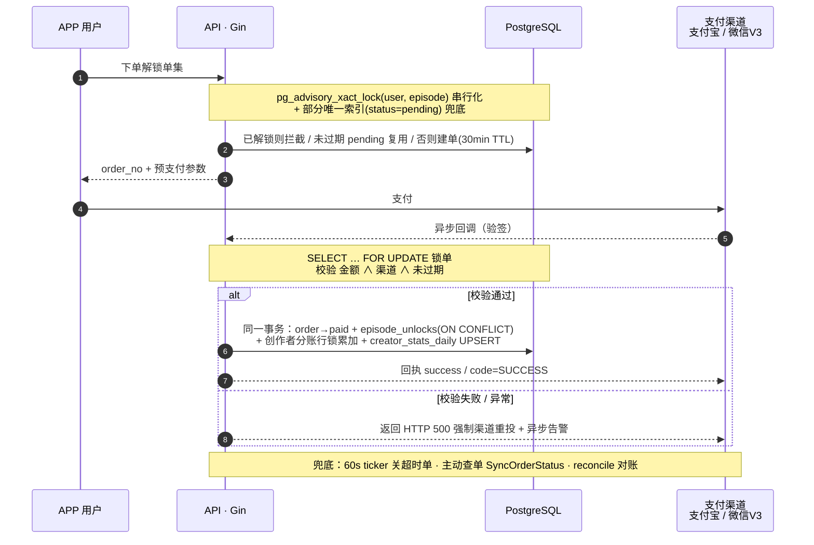
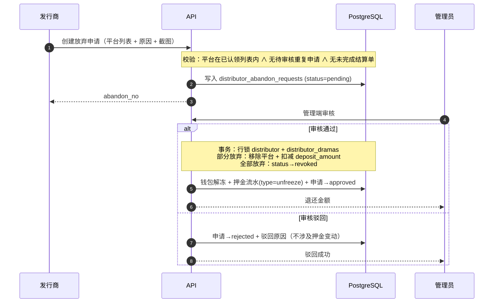
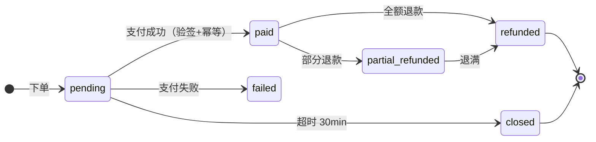

# short-drama-backend

> 短剧平台 MVP 后端 — 用户 / 创作者 / 发行商 / 管理四端一体，覆盖**内容生产 → 上架发行 → 付费解锁 → 收益分账 → 提现结算**的完整闭环。
>
> A production-grade backend for a short-drama (micro-drama) platform: four-sided auth, pay-to-unlock ordering, multi-channel payments with refund & reconciliation, distributor deposit & claim, revenue split, settlement & withdrawal — shipped with zero-downtime deploys.

`Go 1.25` · `Gin` · `GORM` · `PostgreSQL` · `Redis` · `腾讯云 SMS / COS / VOD` · `微信支付 V3 / 支付宝`

[](https://go.dev)


**45** 张表 · **289** 条路由 · **4** 端独立鉴权 · **2** 支付渠道 · **0** 停机发版

---

## English Summary

**short-drama-backend** is the backend for a micro-drama (短剧) streaming platform, built **solo, from scratch, in Go**. It powers three end-to-end business loops — *users browsing & paying to unlock episodes*, *creators uploading & monetizing*, and *distributors claiming dramas & distributing across platforms* — across **four independently-authenticated surfaces** (App / Creator / Distributor / Admin), spanning 45 tables and 289 endpoints.

The engineering focus is on two things a payment backend should take most seriously: **money correctness** and **uptime**.

- **Payment integrity** — Concurrent ordering is serialized with a Postgres transaction-level advisory lock plus a partial unique index, so a user double-tapping "unlock" can never create duplicate charges. Payment callbacks are **signature-verified and idempotent** inside a `SELECT … FOR UPDATE` transaction (amount *and* channel must match, otherwise the handler returns HTTP 500 to force the gateway to retry rather than silently swallow it); marking an order paid, writing the unlock record, and crediting the creator's revenue split all commit **atomically**. Refunds support partial / idempotent flows with proportional balance clawback, backed by **active order-status queries** that reconcile state if a callback is ever lost.
- **Distributor deposit & claim system** — Distributors place deposits to claim dramas for specific platforms; deposit amounts scale with drama duration and platform count. The abandon-claim flow allows distributors to relinquish platforms with a **symmetric refund algorithm** (original deposit minus remaining platforms' share), all executed inside a single transaction with row-level locking. Admin-side approval enforces status validation and wallet consistency.
- **Payment-channel abstraction** — A single `Provider` interface (`Prepay` / `VerifyAndParse` / `QueryOrder` / `Refund`) routes **Alipay (production)** and **WeChat Pay V3** across app & H5 scenes; missing credentials degrade to a safe "unavailable" provider instead of pretending to charge.
- **Settlement engine** — Semi-monthly settlement cycles for both creators and distributors: cycle-based revenue aggregation, tax-previewed withdrawals with PDF generation, and invoice tracking.
- **Security** — Subject-isolated JWT (app / creator / distributor / admin), AES-GCM-encrypted PII (ID & bank-card numbers), login brute-force lockout, token-bucket rate limiting, and audit logging that never records request bodies.
- **Zero-downtime deploys** — `cloudflare/tableflip` + systemd: `systemctl reload` hot-restarts the service via `SIGHUP` with listener-fd inheritance, so releases drop zero connections.

**My role:** sole backend owner — architecture, data modeling, every API, payment & settlement, distributor deposit system, security hardening, deployment and ops.

> *The sections below are in Chinese (the project's primary language). This English summary covers the essentials; scroll down for the full detail.*

---

## 一句话概括

这是一套**单体 + 清晰分层**的短剧 App 后端：约 **45 张表**、**289 条路由**、**4 套独立鉴权身份**，把「用户看剧付费」「创作者上传变现」「发行商认领发行」三条主链路完整打通。设计上把工程重心压在**钱**（并发下单、回调验签与幂等、分账事务、退款与对账、发行押金、提现状态机）和**可用性**（零停机发版）上——这也是一个支付型后端最该较真的两件事。

---

## 系统架构



> 部署：systemd + `cloudflare/tableflip` ——「`systemctl reload` = SIGHUP 热重启」，发版零停机、客户端零感知。

### 四端职责

- **APP 端** — 手机号验证码登录（未注册自动注册）、内容浏览 / 搜索 / 剧场推荐、播放与观看历史、点赞（下沉到单集）/ 收藏（整剧）、评论与楼中楼回复、消息中心、**下单解锁单集**、微信 / 支付宝双渠道支付。
- **Creator 端** — 创作者登录、资料与实名认证（含 KYC 活体检测）、渠道账号、短剧 / 剧集 CRUD、云点播上传签名 + 封面图直传签名、收益看板、**结算周期**（半月度）、**提现（含个税预览与算税）**、电子合同、发票。
- **Publisher 端** — 发行商登录、企业认证、剧集广场浏览与筛选、**押金认领**（多平台、保证金按时长与平台数阶梯计算）、已认领剧集管理、**放弃认领**（上传截图证据、押金退还算法）、发行商收益看板、结算与提现。
- **Admin 端** — 内容 / 分类 / 创作者 / 发行商 / 订单 / 提现 / 合同全套 CRUD 与审核，按 `admin / finance / auditor / claim_audit / distributor_audit` 多角色细分权限；**剧集打回**（含分集原因）、**放弃认领审核**、财务侧含**退款**、**主动查单对账**、**渠道收入导入**、**结算单管理**。

---

## 我的职责 / 核心贡献

作为**后端负责人**，独立完成本服务从 0 到 1 的设计、实现与上线运维：

- **整体架构与数据建模** — 单体分层架构、45 张表的数据模型、289 条路由、四端鉴权体系；从建表迁移、索引设计到部署运维全链路落地。
- **支付与资金安全（核心）** — 设计并实现下单防并发（`advisory lock` + 部分唯一索引）、回调验签与幂等、分账事务、退款（部分 / 全额 / 幂等 / 按比例回退）、对账兜底（主动查单 + 定时关单 + reconcile）；目标是在支付场景下**不重复扣款、不漏账、不错账**。
- **发行商押金与认领体系** — 设计并实现多平台押金认领（保证金按剧集时长 × 平台数阶梯计算）、放弃认领流程（退还押金 = 原始押金 − 剩余平台应收，事务行锁保证并发安全）、管理端审核（通过 / 驳回 + 原因截图）。
- **结算引擎** — 创作者 + 发行商双轨结算，半月度结算周期，按日收入统计聚合并生成结算单；提现含个税预览、PDF 生成、发票跟踪。
- **多渠道支付接入** — 抽象统一 `Provider` 接口，接入支付宝（生产）与微信支付 V3 双渠道，覆盖 app / H5 / 小程序多端、退款与查单；缺密钥时安全降级而非裸跑。
- **安全加固** — 四身份 JWT 隔离、PII（身份证 / 银行卡）`AES-GCM` 加密、登录防爆破、令牌桶限流、操作审计。
- **工程化与可用性** — 基于 `cloudflare/tableflip` 实现发版零停机；一键部署脚本支持沙箱 / 生产 / 双环境；上线前配置体检与账务对账命令；退款 / 凭据的集成测试 harness。
- **第三方集成** — 腾讯云短信（真实下发）、COS 图片直传签名、VOD 视频上传签名与回调、KYC 实名认证。

> **技术关键词**：Go · 高并发资金安全 · 支付集成 · 发行押金 · 结算引擎 · 分布式幂等 · 零停机部署 · 数据加密 · 四端鉴权

---

## 技术栈与设计取舍

| 维度 | 选型 | 取舍理由 |
|---|---|---|
| 语言 / 框架 | Go 1.25 + Gin | 单二进制部署、启动快、依赖少；并发模型契合 IO 密集的接口服务 |
| 存储 | PostgreSQL + GORM | 事务 + 部分唯一索引 + `advisory lock` 兜并发；AutoMigrate 配手写索引迁移 |
| 缓存 / 幂等 | Redis | `Idempotency-Key` 强幂等、令牌桶限流、验证码冷却与防爆破 |
| 鉴权 | 自签 JWT | `subject = app / creator / distributor / admin` 四个身份隔离，中间件拒绝跨身份调用 |
| 第三方 | 腾讯云 SMS / COS / VOD / KYC | 短信真实下发，图片直传签名，视频点播上传签名 + 回调，实名认证 |
| 支付 | 微信支付 V3 + 支付宝 | Provider 抽象，多端 app / H5(wap)，支持退款与对账；本地 mock 联调 |
| 部署 | systemd + tableflip | SIGHUP fork+exec 热重启，发版零停机；一键部署脚本支持沙箱/生产/双环境 |

---

## 工程亮点（设计决策与权衡）

> 这一节是我最想展示的部分——不是"用了什么"，而是"遇到什么问题、为什么这么解"。

### 1) 钱链路：把每一个并发与重试都堵死

下单到分账的完整时序，并发与回调重试都在事务里收口（实现见 [`internal/billing/billing.go`](internal/billing/billing.go)）：



**并发下单。** 同一用户狂点"解锁"，朴素实现会产生多笔 pending 订单甚至重复扣款。解法是双保险：进入下单事务先 `pg_advisory_xact_lock(user_id, episode_id)` 拿事务级建议锁串行化同一 (用户, 集) 的请求，再叠加一条**部分唯一索引** `WHERE status='pending'` 兜底——已解锁直接拦截、未过期 pending 复用、否则建单（30 分钟 TTL）。

**支付回调幂等 + 校验。** 回调处理在事务内 `SELECT ... FOR UPDATE` 锁订单，必须同时满足 (订单存在 ∧ pending ∧ 未过期 ∧ **金额一致** ∧ **渠道一致**) 才标记 paid；已 paid 直接幂等返回成功；任一校验不过则**返回 HTTP 500 让支付渠道重试**并异步告警，绝不静默吞掉。

**分账原子化。** 同一事务内一气呵成：`订单→paid` → 写 `episode_unlocks`（`ON CONFLICT` 去重）→ creator 行锁累加 `total_income / balance` → 当日 `creator_stats_daily` UPSERT。要么全成，要么全滚。

**退款（部分 / 全额 / 幂等）。** 以商户退款单号 `refund_no` 做幂等键（同号重入返回原结果）；支持多次部分退款累计校验（`paid → partial_refunded → refunded`）；按创作者分成比例**从其余额与当日统计回退**（用 `GREATEST` 防写负）；下沉调用渠道退款 API（支付宝 `trade.refund` / 微信退款）。集成测试见 [`cmd/test-refund`](cmd/test-refund/main.go)。

**对账兜底。** ① 后台 ticker 每 60s 扫过期 pending 关单 + 告警；② **主动查单** `SyncOrderStatus` 直连渠道查真实状态回写本地；③ 独立 [`reconcile`](cmd/reconcile/main.go) 命令做账务一致性校验，发现不平直接 `exit 1`（可挂 CI / 定时巡检）。

### 2) 发行商押金与认领体系

发行商在剧集广场浏览已上架剧集，选定平台后支付押金认领。押金按 `基础金额 × (1 + 0.15 × (平台数 − 1))` 阶梯计算，基础金额由剧集时长分档（≤25 分钟 / ≥26 分钟）。认领通过后签署电子合同，获得对应平台的发行授权。

**放弃认领**（实现见 [`internal/handler/publisher_abandon.go`](internal/handler/publisher_abandon.go)）：



- 退还金额 = 原始押金 − 基础金额 × (1 + 0.15 × (剩余平台数 − 1))，与认领时对称
- 审核中使用事务 + 行锁保证并发安全，与 `adminRejectClaim` 模式一致
- 放弃审核期间，被放弃的平台仍标记为占用，防止其他发行商在审核期间抢认
- 支持上传最多 9 张原因截图作为放弃证据

### 3) 支付渠道抽象：上层不感知渠道差异

统一 `Provider` 接口（`Prepay` / `VerifyAndParse` / `QueryOrder` / `Refund`，定义见 [`internal/payment/provider.go`](internal/payment/provider.go)），运行时按 `payment_method` 路由，下单 / 解锁 / 回调 / 退款的上层逻辑对渠道**零耦合**：

- [`AlipayProvider`](internal/payment/alipay_provider.go) — 社区库 `smartwalle/alipay/v3`，公钥模式，沙箱 / 生产网关可切，`app→order_string` / `wap→pay_url` 多端；`DecodeNotification` 一步验签 + 解析。
- [`WechatProvider`](internal/payment/wechat_provider.go) — 官方 `wechatpay-go`，V3 自动下载平台证书、`AEAD_AES_256_GCM` 解密回调，app（二次签名参数）/ H5 多端。
- [`DevProvider`](internal/payment/dev_provider.go) — 纯标准库 mock，本地一键模拟支付，联调主链路不依赖外部资质。
- [`UnavailableProvider`](internal/payment/unavailable_provider.go) — 生产缺密钥时的**安全阀**：拒单而非裸跑。

> 切换逻辑与运行模式解耦：**配齐哪个渠道的密钥就启用哪个真实 Provider**，初始化失败自动降级为 Unavailable。密钥支持**文件路径**注入（不进 `.env`/不进 commit）。

### 4) 四身份鉴权与纵深安全

- **身份隔离**：app / creator / distributor / admin 各自独立签发 JWT，中间件按 `subject` 严格隔离（见 [`internal/middleware/auth.go`](internal/middleware/auth.go)），杜绝拿 A 端 token 调 B 端接口；账号封禁**每次请求查库**即时生效。
- **防爆破**：Admin 错密码 5 次锁 15 分钟（落库）；短信错码 ≥5 次锁定 + 按 IP 限流 + 60s 重发冷却。
- **PII 加密**：身份证号 / 银行卡号以 `AES-GCM` 密文落库（见 [`internal/secure/secure.go`](internal/secure/secure.go)），接口默认脱敏只回尾号（`***5678`）。
- **审计**：记录 `actor / method / path / action / status / IP / UA`，**不记请求体**（避免把敏感入参写进日志）。
- **CORS**：白名单 + `Vary: Origin`，禁止 `*` 携带 credentials。

### 5) 结算引擎

支持创作者和发行商双轨结算，半月度结算周期（1-15 日 / 16-月末）：

- 按日收入统计（`creator_stats_daily` / `distributor_income_daily`）聚合生成结算单
- 结算单支持**草稿 → 已确认 → 已支付**状态流转
- 提现含个税预览（累进税率 `tax_brackets` 表）、PDF 结算单生成、发票跟踪
- 渠道收入支持批量导入，自动匹配创作者与剧集

### 6) 零停机发版

API 接入 `cloudflare/tableflip` + systemd `PIDFile` 模式（入口见 [`cmd/api/main.go`](cmd/api/main.go)）：`systemctl reload` → SIGHUP → fork+exec 新进程**继承监听 fd** → 新进程 Ready 后老进程优雅退出。一键部署脚本（[`scripts/deploy-prod.sh`](scripts/deploy-prod.sh)）支持沙箱、生产、双环境三种模式，含编译、配置体检、冒烟测试、reload、ready 探针验证全流程。详见 [`docs/DEPLOYMENT.md`](docs/DEPLOYMENT.md)。

---

## 数据模型与关键状态机

45 张表，按域划分：

- **内容**：`dramas` / `episodes` / `drama_covers` / `drama_characters` / `categories` / `languages`（语言+方言）/ `drama_tags`
- **用户与行为**：`users` / `play_histories`（一剧一条）/ `user_actions`（点赞等）/ `comments`（可空 `episode_id` 区分剧评 / 集评）/ `notifications` / `app_messages`
- **交易**：`products` / `orders` / `episode_unlocks` / `creator_stats_daily` / `channel_income_daily` / `channel_income_import_batches`
- **创作者与结算**：`creators` / `creator_channel_accounts` / `withdrawals` / `tax_brackets`（个税速算）/ `contracts` / `settlements` / `settlement_items` / `invoices` / `state_transitions`
- **发行商**：`distributors` / `distributor_applications`（认领申请）/ `distributor_dramas`（授权关联）/ `distributor_abandon_requests`（放弃申请）/ `distributor_contracts` / `distributor_deposit_transactions`（押金流水）/ `distributor_income_daily` / `distributor_settlements` / `distributor_withdrawals` / `distributor_invoices`
- **支撑**：`admins` / `admin_permissions` / `sms_codes` / `operation_logs` / `global_configs`

**订单状态机**（资金核心，回调 / 退款 / 超时均收敛于此）：



**其余状态流转**

```
Drama         : draft → reviewing → awaiting_publish → published → offline
                审核中可打回(sendback)至 draft，支持总体原因 + 分集原因
                audit_status: pending / approved / rejected

Withdraw      : pending → approved → paid   /   pending → rejected
                余额 balance ↔ 冻结 frozen 双状态流转，申请即快照银行信息+主体类型+算税

Claim         : deposit_pending → auth_pending → review_pending → contract_pending → authorized
                押金缴纳 → 授权确认 → 内容审核 → 合同签署 → 已授权，任意环节可驳回

Abandon Claim : pending → approved / rejected
                审核通过后押金退还、授权记录变更；驳回后可重新申请
```

---

## 权衡 / 已知取舍 / 下一步

- **单体未拆微服务** — 当前规模下单库的「事务 + 行锁 + advisory lock」就足以保证资金一致性，硬拆反而引入分布式事务复杂度。代码已按业务域分层（billing / payment / content / creator / distributor / settlement …），真到瓶颈时可按模块平滑拆出。
- **对账靠命令 + 定时触发，非实时** — `reconcile` 目前手动 / 定时跑、发现不平 `exit 1`，尚未做实时对账与自动冲正。下一步挂 CI / 定时巡检并接告警闭环。
- **测试以核心单测 + 集成 harness 为主，未接 CI 流水线** — 支付验签、金额换算、退款（14 场景 54 断言）都覆盖了，但还没接 GitHub Actions 做自动回归。下一步补 CI。
- **缓存用得保守** — Redis 目前只承担幂等 / 限流 / 验证码，热点内容查询暂未加缓存层，先保一致性。读多写少的列表页有流量后再按需加。
- **可观测偏轻** — 现在是失败事件 webhook 告警，未接指标 / 链路追踪。下一步补 Prometheus 指标 + 关键链路埋点。

---

## 目录结构

```
cmd/
├── api/                  HTTP 服务入口（graceful shutdown + 后台 cron + tableflip 零停机）
├── check-config/         上线前配置体检：go run ./cmd/check-config --prod
├── close-expired-orders/ 过期订单关闭（也由 api 后台 ticker 触发）
├── gen-income-template/  渠道收入导入模板生成
├── publish-scheduled/    定时发布到点的计划短剧（systemd timer 配套）
├── reconcile/            账务对账，发现不平直接 exit 1
├── seed-langzhi/         种子数据（开发/测试环境）
├── setup-cos-referer/    COS Referer 防盗链配置
├── test-alipay/          支付宝凭据 / 网关连通性烟测（不依赖 DB）
└── test-refund/          退款集成测试：部分退/全退/幂等/并发行锁/分账回退（14 场景 54 断言）

internal/
├── config/        环境变量装配（命名对齐腾讯云官方）
├── database/      连接 + AutoMigrate + 索引迁移 + 初始管理员
├── model/         全部 ORM 模型（45 张表）
├── middleware/    JWT 鉴权（app / creator / distributor / admin 隔离）
├── secure/        AES-GCM 加密（PII 字段）
├── idempotency/   Idempotency-Key 中间件（请求体哈希 + 响应缓存）
├── ratelimit/     全局 + 路径级令牌桶
├── alert/         失败事件异步推 webhook
├── sms/           DevProvider + TencentProvider
├── kyc/           实名认证 Provider（腾讯云 KYC）
├── payment/       Provider 抽象：Dev / Wechat / Alipay / Unavailable（Prepay/验签/查单/退款）
├── billing/       订单 / 解锁 / 分账 / 退款 / 对账（事务 + 行锁 + advisory lock）
├── reconcile/     账务一致性校验
├── cos/ · vod/    腾讯云对象存储 / 云点播签名与回调
├── response/      统一响应格式
├── redisclient/   Redis 客户端
├── seed/          种子数据辅助
└── handler/       HTTP handler 按业务域拆 74 个文件

docs/
├── DEPLOYMENT.md                    systemd + Nginx + HTTPS 部署说明
├── ADMIN_ROLES.md                   管理员角色与权限说明
├── CLAIM_API_CHANGES_0.15.1.md      认领 API 变更记录
├── openapi-abandon-claim-0.16.0.yaml 放弃认领 OpenAPI 文档
├── openapi-claim-0.15.1.yaml         认领 OpenAPI 文档
├── openapi-billing-sync-0.15.2.yaml  账单同步 OpenAPI 文档
└── openapi-drama-sendback-0.16.1.yaml 剧集打回 OpenAPI 文档

scripts/
├── deploy-prod.sh     零停机部署脚本（支持 ENV=prod|sandbox|both）
├── deploy-remote.sh   远程部署辅助
├── smoke-test.sh      冒烟测试
└── migrate-*.sh       数据库迁移脚本
```

---

## 质量保障

- **单元测试**：支付验签（自签自验）、金额换算、退款 / 查单等核心逻辑覆盖。
- **集成测试入口**：`cmd/test-refund` 用快照 + defer 清理跑 14 场景 / 54 断言（部分退 / 全退 / 同号幂等 / 超额拒 / 5 goroutine 并发行锁 / 分账回退 / 防写负 / 边界），不污染数据；`cmd/test-alipay` 一次性验证凭据 + 网关连通 + 本地签名。
- **上线前体检**：`check-config --prod` 校验关键配置齐全（缺则拒启动），`reconcile` 账务不平即 `exit 1`。
- **可观测**：失败事件（过期关单失败 / 支付回调失败 / 金额不一致等）异步推送告警 webhook。

---

## 快速开始

```bash
# 前置：本机 PostgreSQL、Redis、Go 1.25
createdb ai_drama

# 1. 准备配置（.env 已被 .gitignore 拦住，不会进库）
cp .env.example .env
#    至少填 DATABASE_DSN / JWT_SECRET / DATA_ENCRYPTION_KEY
#    DATA_ENCRYPTION_KEY 用 `openssl rand -base64 32` 生成（多实例须共用同一份）

# 2. 启动（开发模式：短信回显验证码、支付走 mock）
set -a && source .env && set +a
go run ./cmd/api
```

首次启动会 AutoMigrate 建表，并按 `ADMIN_INIT_USERNAME / ADMIN_INIT_PASSWORD` 创建管理员（默认占位，上线必改）。

开发态 `PAYMENT_DEV_MODE=true` 时挂载 `POST /v1/dev/orders/:order_no/pay` 一键模拟支付成功，便于前端联调主链路：

```
sms/send → app/auth/login → 浏览 → episodes/:id/play(锁) → orders(下单)
        → dev 模拟支付 → orders/:no(paid) → play(拿 play_url)
```

---

## 路由总览

| 前缀 | 数量 | 说明 |
|------|------|------|
| `/health` `/ready` | 2 | 健康检查（无 v1 前缀） |
| `/v1/common` | 5 | 公共接口（短信、上传签名、语言、App 版本） |
| `/v1/app` | 39 | App 端（14 公开 + 25 需登录） |
| `/v1/creator` | 63 | 创作者端（含 verified 中间件） |
| `/v1/distributor` | 7 | 发行商端（认证/资料） |
| `/v1/publisher` | 35 | 发行商发布端（广场/认领/放弃/结算） |
| `/v1/admin` | 131 | 管理后台（含权限控制中间件） |
| `/v1/webhooks` | 3 | 支付/VOD 回调 |
| `/v1/dev` | 4 | 开发模式（仅 `PAYMENT_DEV_MODE=true`） |

---

## 统一约定

**响应格式**：`{ "code": int, "message": string, "data": ... }`

| code | HTTP | 含义 |
|---:|:---:|---|
| 0 | 200 | 成功 |
| 40001 | 200 | 参数 / 验证码错误 |
| 40101 | 200 | 未登录 / token 失效 |
| 40301 | 200 | 无权限 / 封禁 / 身份不匹配 |
| 40401 | 200 | 资源不存在 |
| 40901 | 200 | 重复操作 / 频控冲突 |
| 42001 | 200 | 剧集未解锁 |
| 42901 | 429 | 命中限流 |
| 50001 | 500 | 服务端 / 第三方失败 |

错误码语义与 HTTP 状态解耦：业务错误统一 200 + `code`（仅限流走 429、服务端错走 500），前端按 `code` 分支，避免把业务态当传输错误处理。

---

## 运维命令

```bash
# 部署
ENV=prod    ./scripts/deploy-prod.sh   # 生产环境
ENV=sandbox ./scripts/deploy-prod.sh   # 沙箱环境
ENV=both    ./scripts/deploy-prod.sh   # 双环境（先沙箱后生产）

# 诊断
go run ./cmd/check-config --prod       # 上线前配置体检
go run ./cmd/close-expired-orders      # 关闭过期未支付订单
go run ./cmd/reconcile                 # 账务对账，不平则 exit 1
```

---

> © 2026 黄少政（shaozheng0503）。本仓库是真实项目后端的**脱敏副本，仅作个人作品展示**，未授予商用 / 二次分发许可。